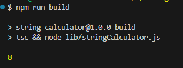
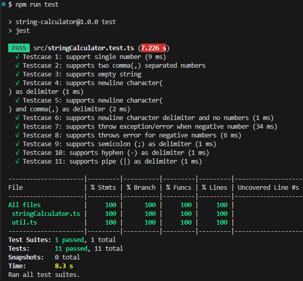

# String Calculator


## Prerequests

- Install Latest stable [Node](https://nodejs.org/en/download) as per your system configuration.

## Steps to setup the repository


#### 1. Clone the repository:
```sh
git clone https://github.com/rishabjn/string-calculator.git
```

#### 2. Open the project in your IDE(Eg. VScode) and run the below command.

```sh
npm install 
```

#### 3. To run the project

```sh
npm run build 
```

#### 4. To test the project
```sh
npm run test 
```

## Test Driven Development report and analysis.

### Build
- You can run the script by executing `npm run build` and providing your desired inputString in [stringCalculator](./src/stringCalculator.ts#18)
- Below is a sample output from the terminal.



### Test Driven Development [Jest framework quality assurance]
- We use the Jest framework to test the script. Learn more about it [here](https://jestjs.io/)
- Run `npm run test` to execute all test cases for the string calculator.
- With Test-Driven Development (TDD), the logic is fully covered by test cases in [stringCalculator.test](./src/stringCalculator.test.ts)
-  Below is a screenshot showing the test results.

